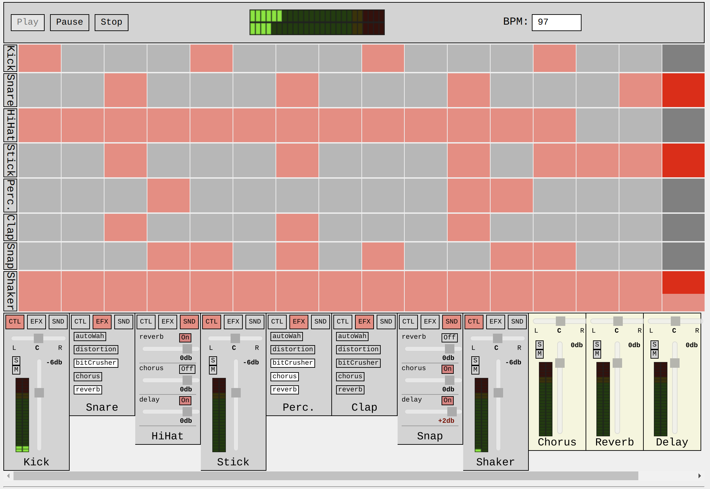

# Web Drum Machine

A web drum machine that runs in the browser. Written in Typescript
using [Tone.js](https://github.com/Tonejs/Tone.js/) Web Audio framework.

## Demo
Try it out: [web-drum-machine.arjanfrans.com](https://web-drum-machine.arjanfrans.com/)

### Development

Installation & running:

1. Install [Node.js](https://nodejs.org/)
2. `npm install`
3. `npm start`

Tools:
* Do a production build and run it on a local server: `npm run start:production`
* Fix and format codestyle: `npm run cs`

### Features
* Adjustable BPM
* Transport controls
* Step sequencer with adjustable steps
* Channel effects
* Effect bus sends
* Panning/volume/mute/solo channel control
