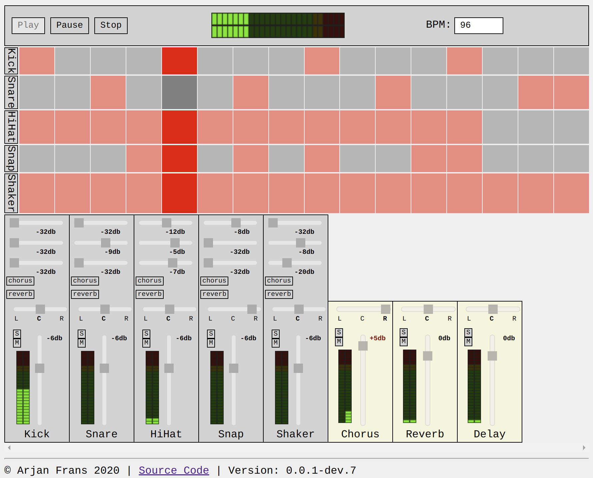

# Web Drum Machine

## Demo
Try it out: [web-drum-machine.arjanfrans.com](https://web-drum-machine.arjanfrans.com/)

### Development

Installation & running:

1. Install [Node.js](https://nodejs.org/)
2. `npm install`
3. `npm start`

Tools:
* Do a production build and run it on a local server: `npm run start:production`
* Fix and format codestyle: `npm run cs`
